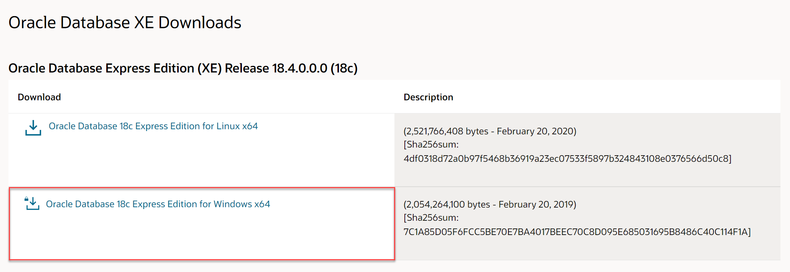
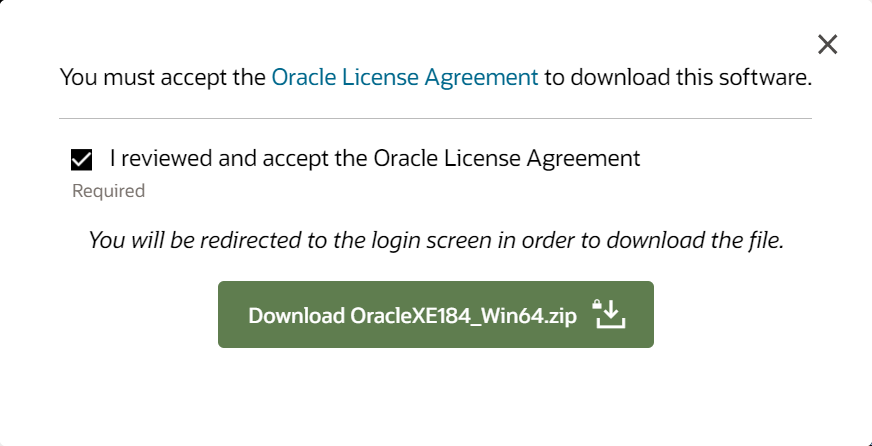
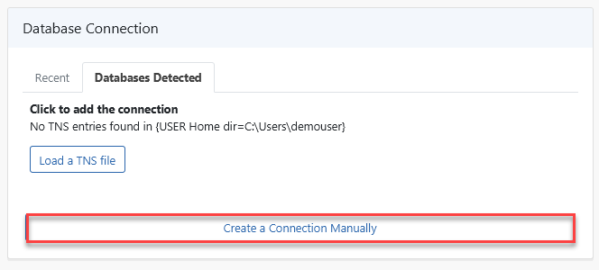
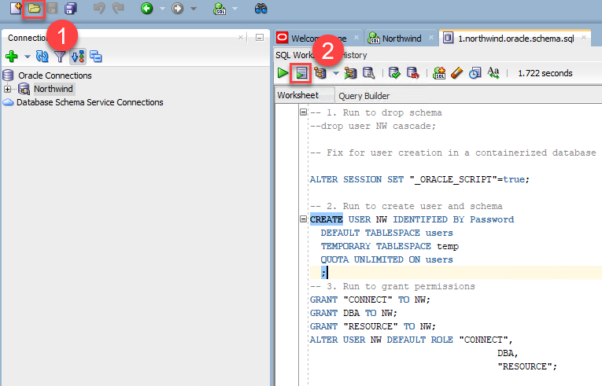
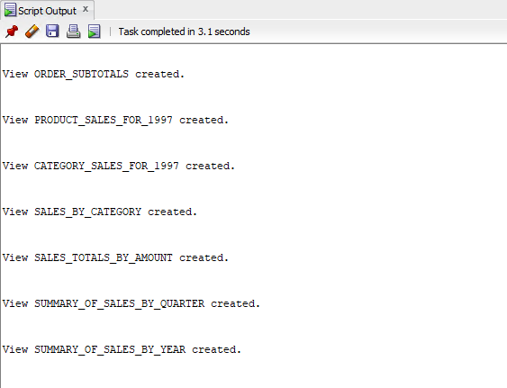
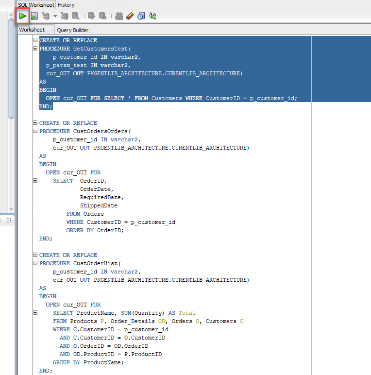
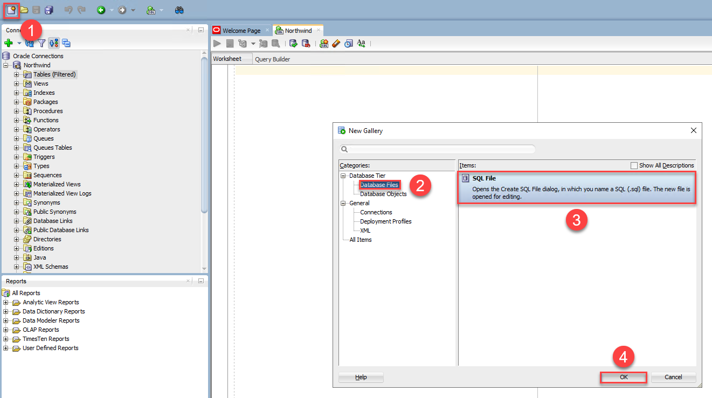
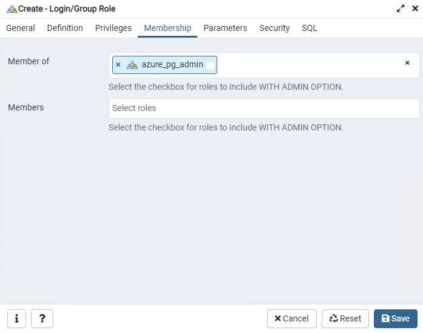
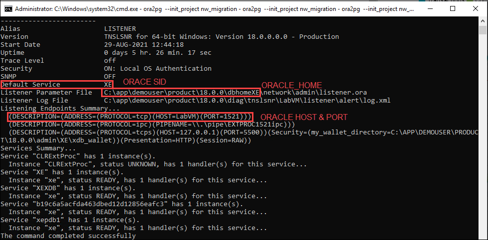
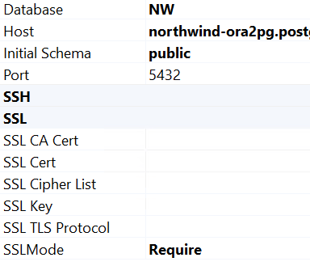

<div class="MCWHeader1">
Migrating Oracle to PostgreSQL
</div>

<div class="MCWHeader2">
Hands-on lab step-by-step
</div>

<div class="MCWHeader3">
November 2020
</div>

Information in this document, including URL and other Internet Web site references, is subject to change without notice. Unless otherwise noted, the example companies, organizations, products, domain names, e-mail addresses, logos, people, places, and events depicted herein are fictitious, and no association with any real company, organization, product, domain name, e-mail address, logo, person, place or event is intended or should be inferred. Complying with all applicable copyright laws is the responsibility of the user. Without limiting the rights under copyright, no part of this document may be reproduced, stored in or introduced into a retrieval system, or transmitted in any form or by any means (electronic, mechanical, photocopying, recording, or otherwise), or for any purpose, without the express written permission of Microsoft Corporation.

Microsoft may have patents, patent applications, trademarks, copyrights, or other intellectual property rights covering subject matter in this document. Except as expressly provided in any written license agreement from Microsoft, the furnishing of this document does not give you any license to these patents, trademarks, copyrights, or other intellectual property.

The names of manufacturers, products, or URLs are provided for informational purposes only and Microsoft makes no representations and warranties, either expressed, implied, or statutory, regarding these manufacturers or the use of the products with any Microsoft technologies. The inclusion of a manufacturer or product does not imply endorsement of Microsoft of the manufacturer or product. Links may be provided to third-party sites. Such sites are not under the control of Microsoft and Microsoft is not responsible for the contents of any linked site or any link contained in a linked site, or any changes or updates to such sites. Microsoft is not responsible for webcasting or any other form of transmission received from any linked site. Microsoft is providing these links to you only as a convenience, and the inclusion of any link does not imply endorsement of Microsoft of the site or the products contained therein.

© 2020 Microsoft Corporation. All rights reserved.

Microsoft and the trademarks listed at <https://www.microsoft.com/en-us/legal/intellectualproperty/Trademarks/Usage/General.aspx> are trademarks of the Microsoft group of companies. All other trademarks are property of their respective owners.

**Contents**

- [Migrating Oracle to PostgreSQL hands-on lab step-by-step](#migratingoracletopostgresql-hands-on-lab-step-by-step)
  - [Abstract and learning objectives](#abstract-and-learning-objectives)
  - [Overview](#overview)
  - [Solution architecture](#solution-architecture)
  - [Requirements](#requirements)
  - [Exercise 1: Setup Oracle 18c Express Edition](#exercise-1-setup-oracle-18c-express-edition)
    - [Task 1: Install Oracle XE](#task-1-install-oracle-xe)
    - [Task 2: Install Oracle Data Access components](#task-2-install-oracle-data-access-components)
    - [Task 3: Install SQL Server Migration Assistant for Oracle](#task-3-install-sql-server-migration-assistant-for-oracle)
    - [Task 4: Install SQL Developer Tool](#task-4-install-sql-developer-tool)
    - [Task 5: Create the Northwind database in Oracle 18c XE](#task-5-create-the-northwind-database-in-oracle-18c-xe)
  - [Exercise 2: Assess the Oracle 18c Database before Migrating to PostgreSQL](#exercise-2-assess-the-oracle-18c-database-before-migrating-to-postgresql)
    - [Task 1: Update Statistics and Identify Invalid Objects](#task-1-update-statistics-and-identify-invalid-objects)
  - [Exercise 3: Prepare to Migrate the Oracle database to PostgreSQL](#exercise-3-prepare-to-migrate-the-oracle-database-to-postgresql)
    - [Task 1: Install pgAdmin on the LabVM](#task-1-install-pgadmin-on-the-labvm)
    - [Task 2: Install ora2pg](#task-2-install-ora2pg)
    - [Task 3: Prepare the PostgreSQL instance using pgAdmin](#task-3-prepare-the-postgresql-instance-using-pgadmin)
    - [Task 4: Create an ora2pg project structure](#task-4-create-an-ora2pg-project-structure)
    - [Task 5: Create a migration report](#task-5-create-a-migration-report)
  - [Exercise 4: Migrate the Database and Application](#exercise-4-migrate-the-database-and-application)
    - [Task 1: Migrate the basic database table schema using ora2pg](#task-1-migrate-the-basic-database-table-schema-using-ora2pg)
    - [Task 2: Migrate Table Data with ora2pg](#task-2-migrate-table-data-with-ora2pg)
    - [Task 3: Finishing the table schema migration](#task-3-finishing-the-table-schema-migration)
    - [Task 4: Migrate Views](#task-4-migrate-views)
    - [Task 5: Migrate the Stored Procedure](#task-5-migrate-the-stored-procedure)
    - [Task 6: Create new Entity Data Models and update the application on the Lab VM](#task-6-create-new-entity-data-models-and-update-the-application-on-the-lab-vm)
    - [Task 7: Deploy the application to Azure](#task-7-deploy-the-application-to-azure)
  - [After the hands-on lab](#after-the-hands-on-lab)
    - [Task 1: Delete the resource group](#task-1-delete-the-resource-group)

# Migrating Oracle to PostgreSQL hands-on lab step-by-step

## Abstract and learning objectives

In this hands-on lab, you implement a proof of concept (POC) for conducting a site analysis for a customer to compare cost, performance, and level of effort required to migrate from Oracle to Azure Database for PostgreSQL. You evaluate the dependent applications and reports that need to be updated and come up with a migration plan. Also, you help the customer take advantage of new PostgreSQL features to improve performance and resiliency.

At the end of this hands-on lab, you will be better able to design and build a database migration plan and implement any required application changes associated with changing database technologies.

## Overview

Wide World Importers (WWI) has experienced significant growth in the last few years. As the size of their data grows, they have started to experience issues with their existing Oracle OLTP database, including complex upgrade processes, complex licensing, and even a major failure caused by an overflowing audit table.

The WWI CIO has learned of the many benefits that Azure Database for PostgreSQL provides, including AD support, simple pricing, high performance, and high availability. She is also excited about the many similarities between PL/SQL and PL/pgSQL, since that will reduce the migration effort significantly.

WWI's CIO would like a POC of an OLTP database move and proof that the new technology will make her company's operations faster, cheaper, and more efficient. 

## Solution architecture

Below is a diagram of the solution architecture you build in this lab. Please study this carefully, so you understand the whole of the solution as you are working on the various components.

![This solution diagram is divided into Microsoft Azure and on-premises. Azure Database for PostgreSQL - Hyperscale (Citus) serves as the primary OLTP database cluster with support for the efficient analysis of JSON data. Citus supports high availability, which entails pairing two instances to serve as a single node. When one of the instances fails, the other instance--which is kept up to date--is substituted automatically. Logs generated by PostgreSQL's standard logging tools and pgAudit will be stored in Azure Monitor, a tool which allows the analysis of logging data. As for on-premises components, the API app for vendor connections, the Web App for Internet Sales Transactions, and the ASP.NET Core App for inventory management reside locally. BI developers will continue to use Excel and Power BI for reporting.](./media/preferred-solution-architecture-oracle-to-postgres.PNG "Preferred Solution diagram")

The solution begins by installing and using ora2pg to assess the task of migrating the Oracle XE database supporting the application to Azure Database for PostgreSQL. Then, the tool will be used to migrate the table schema without indexes or constraints to the target. Azure Database Migration Service will be used to migrate data from Oracle to PostgreSQL. Remaining objects, including stored procedures and views, will be modified and exported to PostgreSQL through ora2pg. At this point, we will need to modify the MVC application. The first step is to create new entity models and update controllers to reference the new models. Then, code will be added to call the home page stored procedure. We will deploy the application to an Azure App Service instance using a publish profile. Azure Monitor will be used to facilitate the storage and analysis of audit logs generated by the cloud PostgreSQL instance. 

## Requirements

- Microsoft Azure subscription must be pay-as-you-go or MSDN.
  - Trial subscriptions will not work.
- A virtual machine configured with Visual Studio 2019 Community edition.

    >**Note**: If you find that your Visual Studio 2019 VM image comes with Visual Studio 2017, and not 2019, you will need to manually install 2019 Community from [here](https://visualstudio.microsoft.com/downloads/). Ensure that the **ASP.NET and web development** and **Azure development** Workloads are enabled for your installation.

## Exercise 1: Setup Oracle 18c Express Edition

Duration: 45 minutes

In this exercise, you will install Oracle XE on your Lab VM, load a sample database supporting an application, and then migrate the database to the Azure SQL DB instance.

### Task 1: Install Oracle XE

1. Connect to your Lab VM, as you did in Task 5 of the [Before the Hands-on Lab](./Before%20the%20HOL%20-%20Migrating%20Oracle%20to%20Azure%20SQL%20and%20PostgreSQL.md#task-5-connect-to-the-lab-vm) exercise.

   - **Username**: demouser
   - **Password**: Password.1!!

2. In a web browser on your Lab VM, navigate to <https://www.oracle.com/database/technologies/xe-downloads.html>.

3. On the Oracle Database XE Downloads page, select **Oracle Database 18c Express Edition for Windows x64** download link.

   

4. Accept the license agreement, when prompted, and then select **Download OracleXE184_Win64.zip**. You might need to select the **Oracle License Agreement** link and scroll to the bottom of the agreement to enable the checkbox.

   

5. Sign in with your Oracle account to complete the download. If you don't already have a free Oracle account, you will need to create one.

   

6. After signing in, the file will download.

7. Unzip the file, and navigate to the `DISK1` folder.

8. Right-click `setup.exe`, and select **Run as administrator**.

   

9. Select **Next** to step through each screen of the installer, accepting the license agreement and default values, until you get to the **Specify Database Passwords** screen.

10. On the **Oracle Database Information** screen, set the password to **Password.1!!**, and select **Next**.

    

11. Select **Install**. Once the installation completes, take note of the ports assigned.

    

12. Select **Finish** on the final dialog to compete the installation.

### Task 2: Install Oracle Data Access components

1. On your Lab VM, navigate to <http://www.oracle.com/technetwork/database/windows/downloads/index-090165.html>.

2. On the 64-bit Oracle Data Access Components (ODAC) Downloads page, scroll down and locate the **64-bit ODAC 12.2c Release 1 (12.2.0.1.1) for Windows x64** section, and then select the **ODAC122011_x64.zip** link.

    Downloads screen")

3. Accept the license agreement, and then select **Download ODAC122011_x64.zip**.

   

4. When the download completes, extract the contents of the ZIP file to a local drive.

5. Navigate to the folder containing the extracted ZIP file, and right-click `setup.exe`, then select **Run as administrator** to begin the installation.

6. Select **Next** to accept the default language, English, on the first screen.

7. On the Specify Oracle Home User screen, accept the default, Use Windows Built-in Account, and select **Next**.

8. Accept the default installation locations, and select **Next**.

9. On the **Available Product Components**, uncheck **Oracle Data Access Components Documentation for Visual Studio**, and select **Next**.

   

10. On the ODP.NET screen, check the box for **Configure ODP.NET and/or Oracle Providers for ASP.NET at machine-wide level**, and select **Next**.

    

11. If the Next button is disabled on the Perform Prerequisite Checks screen, check the **Ignore All** box, and then select **Next**. This screen will be skipped by the installer if no missing prerequisites are found.

    

12. On the Summary screen, select **Install**.

13. On the Finish screen, select **Close**.

### Task 3: Install SQL Server Migration Assistant for Oracle

1. On your Lab VM, download SQL Server Migration Assistant v8.x for Oracle from <https://www.microsoft.com/en-us/download/details.aspx?id=54258>.

2. Select the Download button to download SSMA.

   

   >**Note**: Download the latest version.

3. Check the box next to **SSMAforOracle_8.x.0.msi**, and select **Next** to begin the download.

   

4. Run the downloaded installer, and select **Next** on the Welcome screen.

   

5. Accept the License Agreement, and select **Next**.

6. On the Choose Setup Type screen, select **Typical**, which will move you to the next screen.

   

7. Select **Install** on the Ready to Install screen.

   

8. Select **Finish** when the installation is complete.

### Task 4: Install SQL Developer Tool

In this task, you will install Oracle SQL Developer, a common IDE to interact with Oracle databases.

1. On your Lab VM, open a web browser and navigate to <https://www.oracle.com/tools/downloads/sqldev-downloads.html>.

2. Scroll down on the page and download **Windows 64-bit with JDK 8 included**.

   

3. Accept the license terms. Extract the files to `C:\Tools`.

4. Navigate to `C:\Tools\sqldeveloper`. Select and run the executable file. Ensure that SQL Developer loads.

   

   >**Note**: If you are prompted to import preferences from a previous installation, select **No**.

### Task 5: Create the Northwind database in Oracle 18c XE

WWI has provided you with a copy of their application, including a database script to create their Oracle database. They have asked that you use this as a starting point for migrating their database and application to Azure SQL DB. In this task, you will create a connection to the Oracle database on your Lab VM.

1. In a web browser on LabVM, download a copy of the [Migrating Oracle to  Azure SQL and PostgreSQL upgrade and migration MCW repo](https://github.com/microsoft/MCW-Migrating-Oracle-to-Azure-SQL-and-PostgreSQL/archive/master.zip).

2. Unzip the contents to **C:\handsonlab**.

3. Launch SQL Developer from the `C:\Tools\sqldeveloper` path from earlier. In the **Database Connection** window, select **Create a Connection Manually**.

   

4. Provide the following parameters to the **New / Select Database Connection** window. Select **Connect** when you are complete.

   - **Name**: Northwind
   - **Username**: system
   - **Password**: Password.1!!
   - Keep the **Details** at their defaults

   

5. Once the connection completes, select the **Open File** icon (1). Navigate to `C:\handsonlab\MCW-Migrating-Oracle-to-Azure-SQL-and-PostgreSQL-master\Hands-on lab\lab-files\starter-project\Oracle Scripts\1.northwind.oracle.schema`. Then, execute the DDL statements (2).

   

6. Right-click the **Northwind** connection and select **Properties**. Then, edit the **Username** to `NW`, and the **Password** to `oracledemo123`. Select **Connect**. Note that you may be asked to enter the password again.

7. In the Open File dialog, navigate to `C:\handsonlab\MCW-Migrating-Oracle-to-Azure-SQL-and-PostgreSQL-master\Hands-on lab\lab-files\starter-project\Oracle Scripts`, select the file `2.northwind.oracle.tables.views.sql`, and then select **Open**.

8. As you did previously, run the script. Note that SQL Developer provides an output pane to view any errors.

   

9. Repeat steps 7 - 8, replacing the file name in step 26 with each of the following:

    - `3.northwind.oracle.packages.sql`

    - `4.northwind.oracle.sps.sql`

      - During the Execute script step for this file, you will need to execute each CREATE OR REPLACE statement independently.

      - Using your mouse, select the first statement, starting with CREATE and going to END. Then, run the selection, as highligted in the image.

      

      - Repeat this for each of the remaining CREATE OR REPLACE... END; blocks in the script file (there are 7 more to execute, for 8 total).

    - `5.northwind.oracle.seed.sql`

      > **Important**: This query can take several minutes to run, so make sure you wait until you see the **Commit complete** message in the output window before executing the next file.

    - `6.northwind.oracle.constraints.sql`

## Exercise 2: Assess the Oracle 18c Database before Migrating to PostgreSQL

Duration: 15 mins

In this exercise, you will prepare the existing Oracle database for its migration to PostgreSQL. Preparation involves two main steps. The first step is to update the database statistics. Statistics about the database become outdated as data volumes and activity change over time. Second, you will need to identify invalid objects in the Oracle database. The migration utility will not migrate invalid objects.

### Task 1: Update Statistics and Identify Invalid Objects

1. Create a new folder titled `Postgre Scripts` at the `C:\handsonlab\MCW-Migrating-Oracle-to-Azure-SQL-and-PostgreSQL\Hands-on lab\lab-files\starter-project` location.

2. Launch SQL Developer. Open the **Northwind** database connection.

3. Create a new SQL file using the **New** button (1). Select **Database Files** (2) and **SQL File** (3). Select **OK** (4). 

    
   
4. Call the new SQL File `update-18c-stats.sql`. Save it in the `Postgre Scripts` directory from earlier.

5. Now, you will populate the new file with the following statements. Run the file as you did when you populated database objects.

    ```sql
    -- 18c script
    EXECUTE DBMS_STATS.GATHER_SCHEMA_STATS(ownname => 'NW');
    EXECUTE DBMS_STATS.GATHER_DATABASE_STATS;
    EXECUTE DBMS_STATS.GATHER_DICTIONARY_STATS;
    ```

    >**Note**: This script can take over one minute to run. Ensure that you receive confirmation that that the script has executed successfully.

6. Now, we will utilize a query that lists database objects that are invalid and unsupported by the ora2pg utility. It is recommended to fix any errors and compile the objects before starting the migration process. Create a new file named `show-invalid-objects.sql` and save it in the same directory. Run this query to find all of the invalid objects.

    ```sql
    SELECT owner, object_type, object_name
    FROM all_objects
    WHERE status = 'INVALID';
    ```

    >**Note**: You should not see any invalid objects.

## Exercise 3: Prepare to Migrate the Oracle database to PostgreSQL

Duration: 60 minutes

In this exercise, you will configure Azure Database for PostgreSQL and Azure App Service, install and configure ora2pg and pgAdmin, and create an assessment report that outlines the difficulty of the migration process.

### Task 1: Install pgAdmin on the LabVM

PgAdmin greatly simplifies database administration and configuration tasks by providing an intuitive GUI. Hence, we will be using it to create a new application user and test the migration.

1. You will need to navigate to <https://www.pgadmin.org/download/pgadmin-4-windows/> to obtain pgAdmin 4. At the time of writing, **v5.5** is the most recent version. Select the link to the installer, as shown below.

    

2. Download the **pgadmin4-5.5-x64.exe** file.

3. Once the installer launches, accept all defaults. Complete the installation steps.

4. To open pgAdmin, use the Windows Search utility. Type `pgAdmin`.

   

5. PgAdmin will prompt you to set a password to govern access to database credentials. Enter a password. Confirm your choice. For now, our configuration of pgAdmin is complete.

### Task 2: Install ora2pg

**Ora2pg** is the tool we will use to migrate database objects and data. Microsoft's Data Migration Team has greatly simplified the process of obtaining this tool by providing the **installora2pg.ps1** script. You can download using the link below:

 **Download**: <https://raw.githubusercontent.com/microsoft/DataMigrationTeam/master/IP%20and%20Scripts/PostgreSQL%20Migration%20and%20Assessment%20Tools/installora2pg.ps1>.

1. Copy Microsoft's script to the `C:\handsonlab\MCW-Migrating-Oracle-to-Azure-SQL-and-PostgreSQL\Hands-on lab\lab-files\starter-project\Postgre Scripts` location.

    - Press Ctrl+S to save the file from the webpage.
    - In the File Explorer dialog, quote the file name and ensure that the **Save as type** field is set to **All Files**.

        

2. Navigate to the location mentioned above and right-click `installora2pg.ps1`. Then, select **Run with PowerShell**.

    

3. Install the ora2pg utility dependencies.

   - Install Perl. It will take five minutes.
   - Install the Oracle client library and SDK. To do this, you will first need to navigate to [Oracle Downloads](https://www.oracle.com/database/technologies/instant-client/winx64-64-downloads.html). Then, scroll to **Version 12.2.X**. Select the installer for the **Basic Package**.
   - Download the zip file.

    

4. On the same Oracle link as above under the **version** section, locate the **SDK Package** installer under the **Development and Runtime - optional packages** section. Keep the zipped file in the Downloads directory.

    

5. Navigate to the directory where the zipped instant client packages reside.

    - For the basic package, right-click it, and select **Extract All...**.
    - When prompted to choose the destination directory, navigate to the `C:\` location.
    - Select **Extract**.
    - Repeat this process for the zipped SDK.

    

6. Return to the PowerShell script.

    - Press any key to terminate the script's execution.
    - Launch the script once more.
    - If the previous steps were successful, the script should be able to locate **oci.dll** under `C:\instantclient_12_2\oci.dll`.

        >**Note**: The script may throw errors of not being able to find a Git executable at a certain location. This should not impact the installation.

        >**Note**: If the script still cannot find `oci.dll`, rename `C:\instantclient_12_2` to `C:\instantclient`.

7. Once ora2pg installs, you will need to configure PATH variables.

    - Search for **View advanced system settings** in Windows.
    - Select the result, and the **System Properties** dialog box should open.
    - By default, the **Advanced** tab should be showing, but if not, navigate to it.
    - Then, select **Environment Variables...**.

    

8. Under **System variables**, select **Path**. Select **Edit...**.

    

9. The **Edit environment variable** box should be displaying.

    - Select **New**.
    - Enter **C:\instantclient_12_2** (or **C:\instantclient**).
    - Repeat this process, but enter **%%PATH%%** instead.

    

### Task 3: Prepare the PostgreSQL instance using pgAdmin

In this task, we will create the new application user and create the NW database.

1. Launch **pgAdmin** and enter your master password.

2. Under the **Quick Links** section of the Dashboard, there is the option to **Add New Server**. When selected, the **Create - Server** dialog box will open.

3. Under the **General** tab, enter a name for your connection.

    

4. Navigate to the **Connection** tab.

    - You can pull your instance's hostname from the Azure portal (it is available in the resource's overview).
    - For **Username**, enter the admin username available on the instance's overview.
    - For **Password**, enter the admin user password you provided during deployment.
    - Select **Save** when you are ready to connect.

    

5. If the connection is successful, it should appear under the **Servers** browser dropdown.

    

6. Create a new role, which the application will reference.

    - Under your connection, right-click **Login/Group Roles**.
    - Select **Create > Login/Group Role...**.
    - Name the role **NW**.

7. Under **Definition**, provide a secure password.  

8. Under **Privileges**, change the **Can log in?** slider to the **Yes** position.

    

9.  Finally, navigate to **Membership**.

    - Add the **azure_pg_admin** role.
    - Do not select the checkbox next to the role name (this user will not be granting the azure_pg_admin role to others).
    - Select **Save**.

    

Our configuration in pgAdmin is now complete.

### Task 4: Create an ora2pg project structure

**Ora2pg** allows database objects to be exported in multiple files so that is simple to organize and review changes. In this task, you will create the project structure that will make it easy to do this.  

1. Open a command prompt window and navigate to the directory `C:\ora2pg`, where we will create the project structure.

    ```text
    cd C:\ora2pg
    ```

2. To create a project, we will use the ora2pg command with the --init_project flag. In the example below, our migration project is titled nw_migration.

    ```cmd
    ora2pg --init_project nw_migration
    ```

    >**Note**: In some cases, ora2pg may fail to find its configuration file. In scenarios such as these, you may need to provide the -c flag with the name of the actual configuration file in your ora2pg directory. For instance, `ora2pg.conf.dist` did not exist in my directory, but the file `ora2pg_conf.dist` was available.

    >**Note**: You may receive an error that ora2pg cannot find Perl. If this is the case, just ensure that `C:\Strawberry\perl\bin` has been added to the PATH variable.

    ```cmd
    ora2pg -c ora2pg_dist.conf --init_project nw_migration
    ```

3. Verify that the command succeeded. There should be a folder with the same name as your migration project in the C:\ora2pg directory.

    

4. Navigate to the project directory.

    - Locate **config\ora2pg.conf**.
    - Select the file to open it. If you are asked to select an application to open the file, select **Notepad**. We will need to collect multiple parameters of the local Oracle database to enter into the configuration file. These parameters are available by entering **lsnrctl status** into the command prompt.

    

5. In the **config\ora2pg.conf** file, replace the old values in the file with the correct information.

    ```text
    # Set the Oracle home directory
    ORACLE_HOME	C:\app\demouser\product\18.0.0\dbhomeXE

    # Set Oracle database connection (datasource, user, password)
    ORACLE_DSN	dbi:Oracle:host=LabVM;sid=XE;port=1521
    ORACLE_USER	NW
    ORACLE_PWD	oracledemo123
    ```

    Moreover, you need to populate the schema name correctly.

    ```text
    # Oracle schema/owner to use
    SCHEMA	NW
    ```

6. Confirm that all information entered is correct. The command below should display the version of your local Oracle database.

    ```cmd
    cd nw_migration
    ora2pg -t SHOW_VERSION -c config\ora2pg.conf
    ```

7. We will also need to populate connection information for our Postgre instance. We will use the role we created in the previous task.

    

### Task 5: Create a migration report

The migration report tells us the "man-hours" required to fully migrate to our application and components. The report will provide the user with a relative complexity value. In this task, we will retrieve the migration report for our migration.

1. Navigate to the `C:\ora2pg\nw_migration` directory in command prompt.

2. Ora2pg provides a reporting functionality that displays information about the objects in the existing schema and the estimated effort required to ensure compatibility with PostgreSQL. The command below creates a report titled **6-23-report.html** in the reports folder (when executed within the `C:\ora2pg\nw_migration` directory).

    ```cmd
    ora2pg -c config\ora2pg.conf -t SHOW_REPORT --estimate_cost --dump_as_html > reports\6-23-report.html
    ```

    >**Note**: The report displays information for the provided schema--in our case, we placed schema information in `config\ora2pg.conf` before executing the command.

    

    Of particular interest is the migration level. In our case, it is B-5, which implicates code rewriting, since there are multiple stored procedures which must be altered.

    

## Exercise 4: Migrate the Database and Application

Duration: 90 minutes

In this exercise, we will begin the migration of the database and the application. This includes migrating database objects, the data, application code, and finally, deploying to Azure App Service.

### Task 1: Migrate the basic database table schema using ora2pg

In this task, we will migrate the database table schema, using ora2pg and psql, which is a command-line utility that makes it easy to run SQL files against the database.

Exercise 3 covered planning and assessment steps.  To start the database migration, DDL statements must be created for all valid Oracle objects.

1. In almost all migration scenarios, it is advised that table, index, and constraint schemas are kept in separate files. For data migration performance reasons, constraints should be applied to the target database only after tables are created and data copied. To enable this feature, open **config\ora2pg.conf** file. Set **FILE_PER_CONSTRAINT**, **FILE_PER_INDEX**, **FILE_PER_FKEYS**, and **FILE_PER_TABLE** to 1.

    

2. Call the following command in the `C:\ora2pg\nw_migration` directory to obtain object schemas (table schemas will be created in a file called **NW-psql.sql**).

    ```cmd
    ora2pg -c config\ora2pg.conf -o NW-psql.sql -t TABLE -b schema\tables\
    ```

    In our scenario, 13 tables are exported. If you see an unreasonably large number, verify that you provided a schema in the configuration file (see step 8 of the previous task). If all was successful, you will see four files in the **schema\tables** directory.

    

    >**Note**: Open the **schema\tables\NW-psql.sql** file. Notice that all table names are lowercase--using uppercase names for tables and/or columns will require quotations whenever referenced. Furthermore, ora2pg converts data types fairly well. If you have strong knowledge of the stored data, you can modify types to improve performance. You can export individual table schemas in separate files to facilitate the review.

3. Execute the PostgreSQL commands against the PostgreSQL database. You can use any PostgreSQL database client. One way to execute a SQL file against a PostgreSQL database is through the **psql** utility located at the `C:\Program Files\pgAdmin 4\v5\runtime` directory. Just as we did in task 4, append this location to the system PATH variable. Note that you will need to restart your command prompt windows for the change to take effect.

    

4. Reopen the command prompt in the `C:\ora2pg\nw_migration` directory.

    - Enter the following command to run the **NW-psql.sql** file to create tables in the **NW** database.
    - Enter your database's DNS name as the value passed to the -h flag.
    - If the connection is successful, you will be asked to enter your password.
    - Then, the command prompt should show a sequence of **CREATE TABLE** statements.

    ```cmd
    psql -U NW@[Server Name] -h [Server Name].postgres.database.azure.com -d NW < schema\tables\NW-psql.sql
    ```

    >**Note**: If you receive an error like "could not find a 'psql' to execute", use the entire path to the executable in the command (`"C:\Program Files\pgAdmin 4\v5\runtime\psql"`)

### Task 2: Migrate Table Data with ora2pg

In this Task, we will use the ora2pg utility to migrate table data to the PostgreSQL instance, now that we have created the table schema on the landing zone.

1. Navigate to `C:\ora2pg\nw_migration\data` in command prompt and enter the following command.

    ```cmd
    ora2pg -t COPY -o data.sql -c ..\config\ora2pg.conf
    ```

    You should see the following once the command completes. Notice how all 3,308 rows are accounted for.

    

2. In the `data` subdirectory, notice how there are SQL files for all tables and one primary SQL file, titled `data.sql`. Use the following command in command prompt to export data to the PostgreSQL instance.

    ```cmd
    psql -U NW@[SERVER NAME] -h [SERVER NAME].postgres.database.azure.com -d NW < data.sql
    ```

### Task 3: Finishing the table schema migration

We migrated the data before the constraints to reduce the time required to copy data into the tables. In addition, if foreign keys were present on the target tables, data migration would fail. So, in this task, we will add constraints, foreign keys, and indexes to the target tables. This task assumes that you are in the `C:\ora2pg\nw_migration` directory in command prompt.

1. First, layer on constraints (not foreign keys):

    ```cmd
    psql -U NW@[Server Name] -h [Server Name].postgres.database.azure.com -d NW < schema\tables\CONSTRAINTS_NW-psql.sql
    ```

2. Now, Add foreign keys:

    ```cmd
    psql -U NW@[Server Name] -h [Server Name].postgres.database.azure.com -d NW < schema\tables\FKEYS_NW-psql.sql
    ```

3. Next, layer on the indexes:

    ```cmd
    psql -U NW@[Server Name] -h [Server Name].postgres.database.azure.com -d NW < schema\tables\INDEXES_NW-psql.sql
    ```

4. Before migrating views in the next task, let's verify that table data has been properly migrated. Open **pgAdmin** and connect to the database as the NW user. To use **Query Tool**, select **Query Tool** under the **Tools** dropdown.

    

    >**Note**: You will need to select the **NW** database before accessing the Query Tool.

5. Enter the following query into the editor:

    ```sql
    SELECT CONCAT(firstname, ' ', lastname) as name,
       territorydescription
    FROM employees e
     JOIN employeeterritories et ON e.employeeid = et.employeeid
     JOIN territories t ON et.territoryid = t.territoryid;
    ```

6. Now, execute the query by selecting the **execution** button on the toolbar.

    

7. If you were successful, you should see an output similar to the following. The result set should have 49 rows. It is available under the **Data Output** tab.

    

Next, let's take a look at migrating views.

### Task 4: Migrate Views

Views are not referenced by the sample application, but we are including this task here to show you how to do it manually. When we migrate stored procedures, we will show you how to enable an extension that greatly simplifies the migration of objects which reference Oracle-specific functions.  

1. Navigate to the  `C:\ora2pg\nw_migration\schema\views` directory, where we will run ora2pg and psql.

    ```cmd
    cd schema\views
    ora2pg -c ..\..\config\ora2pg.conf -t VIEW -o NW-views.sql
    ```

    >**Note**: Views are exported into individual files. The file specified in the command (NW-views.sql) references the individual files.

2. Before we invoke NW-views.sql, we will need to make changes to four files. This is because our application uses a to_date() function that is not supported in PostgreSQL. We will need to replace the command in the code with the equivalent DATE() function in PostgreSQL. First, in **SALES_TOTALS_BY_AMOUNT_NW-views.sql**, replace the existing last line:

    

    with this:

    

3. In **QUARTERLY_ORDERS_NW-views.sql**, replace the existing last line:

    

    with this:

    

    >**Note**: The other two applications of the `to_date()` function in that file are acceptable, as seen below.

     sample")

4. In **PRODUCT_SALES_FOR_1997_NW-views.sql**, replace the line before the last:

    

    with this:

    

5. Finally, in **SALES_BY_CATEGORY_NW-views.sql**, replace the line before the last:

    

    with this:

    

6. Now that all modifications are complete, run the NW-views.sql file in psql:

    ```cmd
    psql -U NW@[DB Name] -h [DB Name].postgres.database.azure.com -d NW < NW-views.sql
    ```

7. With that, we have migrated views.

    - Navigate to the **Query Editor** and test these migrated views.
    - Utilize the query below, which will show data where **productsales** is greater than 5000. You can envision how this would be useful in an organization to identify successful items in a given year (1997).

    ```sql
    SELECT *
    FROM product_sales_for_1997
    WHERE productsales > 5000;
    ```

8. When the query is executed, you should see the following result set, with 42 rows. This shows that we have successfully migrated the views.

    

Let's migrate stored procedures next.

### Task 5: Migrate the Stored Procedure

Our application utilizes a single stored procedure, so we must be able to migrate it. To do this, we will be using the **orafce** extension utility, which provides functions that are compatible with Oracle code. We will then call the procedure and view its results using a refcursor.

1. Open `C:\ora2pg\nw_migration\config\ora2pg.conf`. There is a directive titled `PLSQL_PGSQL`. Uncomment it. This is necessary for the stored procedure migration.

    ```txt
    # Enable PLSQL to PLPSQL conversion. This is a work in progress, feel
    # free modify/add you own code and send me patches. The code is under
    # function plsql_toplpgsql in Ora2PG/PLSQL.pm. Default enabled.
    PLSQL_PGSQL	1
    ```

2. Only one stored procedure, **NW.SALESBYYEAR**, is in use by the application. So, we will export this stored procedure from the Oracle database for analysis. Run the command below in `C:\ora2pg\nw_migration\schema\procedures`.

    ```cmd
    ora2pg -c ..\..\config\ora2pg.conf -t PROCEDURE -a SALESBYYEAR -o NW-proc.sql
    ```

3. Open `SALESBYYEAR_NW-proc.sql`. Notice that ora2pg exported the Oracle procedure as a PostgreSQL procedure. In some cases, ora2pg exports procedures as functions. Whether that is acceptable depends on if the object needs to return a value and if transactions must be defined within the object. Note that the exported stored procedure is defined as **SECURITY DEFINER**, removing support for transaction control.

    

    A second detail to keep in mind is NULLs vs. empty strings. In PostgreSQL, they are handled differently. This is a small distinction in Oracle that can be overlooked, leading to incomplete query results.

4. We will need to edit the procedure's parameter list, and we can do this by using a refcursor. Replace the existing last parameter of the procedure:

    

    with this:

    

5. A useful PostgreSQL extension that facilitates greater compatibility with Oracle database objects is **orafce**, which is provided with Azure Database for PostgreSQL. To enable it, navigate to pgAdmin, enter your master password, and connect to your PostgreSQL instance. Then, enter the following command into the query editor and execute it:

    ```sql
    CREATE EXTENSION orafce;
    ```

6. Now, you will need to execute the **NW-proc.sql** file against the PostgreSQL instance.

    ```cmd
    psql -U NW@[Server Name] -h [Server Name].postgres.database.azure.com -d NW < NW-proc.sql
    ```

7. Execute the following statements. Note that pgAdmin requires that each statement is executed independently.

    ```sql
    BEGIN;
    CALL salesbyyear('1996-01-01'::timestamp, '1999-01-01'::timestamp, 'cur_out');
    FETCH ALL FROM cur_out;
    COMMIT;
    ```

8. If all is successful, 809 rows should be returned. The following is an excerpt from the result set, which can be retrieved by executing the FETCH statement.

    

### Task 6: Create new Entity Data Models and update the application on the Lab VM

In this task, we will be recreating the ADO.NET data models to accurately represent our PostgreSQL database objects. Entity Framework leverages ADO.NET, allowing us to map database objects to classes.  

1. First, install the Entity Framework.

    - Navigate to the Package Manager console.

    

    Enter the following command:

    ```cmd
    Install-Package EntityFramework
    ```

    >**Note**: We will be using Devart's dotConnect for PostgreSQL, which is an ADO.NET-compatible PostgreSQL driver. This will allow our application to connect to our Azure PostgreSQL instance.

2. Navigate to <https://www.devart.com/dotconnect/postgresql/download.html>.

    - Locate the latest version of **dotConnect for PostgreSQL Professional Trial** (it is **7.17** at the time of writing). 
    - Select **Get Trial**.

    

3. Unless you have a Devart account, select **Sign-Up**.

    

4. Enter your information and select **Sign-Up**.

    

5. Now, you will be redirected to the downloads page.

    - Select **Download**.
    - Run the executable (no need to save).

6. Accept all defaults until **Select Components**. Unselect **SQL Server Business Intelligence Solutions** and **Samples**.

    

7. Continue to the **Ready to Install** screen. Select **Install**. Select **Finish** once setup has completed.

8. Reopen the Visual Studio solution. We will now modify the web.config file to use the Devart PostgreSQL driver.

    - Under the `<providers>` node below the `<entityFramework>` node, add the following statement. Note that you will need to change the assembly version if you use updated DLLs.

    ```xml
    <provider invariantName="Devart.Data.PostgreSql" type="Devart.Data.PostgreSql.Entity.PgSqlEntityProviderServices, Devart.Data.PostgreSql.Entity.EF6, Version=7.17.1666.0, Culture=neutral, PublicKeyToken=09af7300eec23701" />
    ```

    This is how the `<entityFramework>` section of the file should appear:

    

9. We will need to make another change to Web.config. Under the `<DbProviderFactories>` node below the `<system.data>` node, add the following statements (the second statement should be added as a single line). Again, enter your version of the DLL.

    ```xml
    <remove invariant="Devart.Data.PostgreSql" />
    <add name="dotConnect for PostgreSQL" invariant="Devart.Data.PostgreSql" description="Devart dotConnect for PostgreSQL" type="Devart.Data.PostgreSql.PgSqlProviderFactory, Devart.Data.PostgreSql, Version=7.17.1666.0, Culture=neutral, PublicKeyToken=09af7300eec23701" />
    ```

10. Now, add references to multiple assemblies.

    - Under the **Solution Explorer**, right-click **References**.
    - Select **Add Reference**.  
    - Locate **Browse** on the left-hand side of the **Reference Manager** dialog box.
    - Select **Browse** at the bottom right corner of the box.

    

11. The first assembly we will need is **Devart.Data.dll**.
    - Navigate to `C:\Windows\assembly\GAC_MSIL\Devart.Data\[DATA DLL ASSEMBLY VERSION]`.
    - Select the DLL.
    - Select **Add**.

    

12. Now, we need **Devart.Data.PostgreSql.dll**.
    - Navigate to `C:\Windows\assembly\GAC_MSIL\Devart.Data.PostgreSql\[PostgreSQL DLL ASSEMBLY VERSION]`.
    - Select the object.
    - Select **Add**.

13. Finally, we need **Devart.Data.PostgreSql.Entity.EF6.dll**.
    - Navigate to `C:\Program Files (x86)\Devart\dotConnect\PostgreSQL\Entity\EF6`.
    - Select the correct DLL.

14. Now, you will need to rebuild the solution. Under **Build**, select **Rebuild Solution**.

    

15. After the solution rebuilds, delete the existing contents of the **Data** folder. Select all items, right-click, and select **Delete**.

16. Then, right-click the **Data** directory in the **Solution Explorer**.

    - Select **Add** and then **New Item**.
    - Then, select **ADO.NET Entity Data Model**.
    - Name it **DataContext**.
    - Finally, select **Add**.

    

17. On the **Choose Model Contents** page, select **Code First from database**.

    

18. On the **Choose Your Data Connection** page, select **New Connection**.

19. Under the **Connection Properties** window, you will need to change your Data Source to **PostgreSQL Server (dotConnect for PostgreSQL)**.
    - Select **Change**.
    - Choose **PostgreSQL Server** as the **Data source**, and **dotConnect for PostgreSQL** as the **Data provider**.
    - Select **OK**.

    

20. The **Connection Properties** box should open. Enter the DNS name of your Azure PostgreSQL database as the **Host**. Enter **NW@[DB NAME]** as the **User Id**. Provide the user's **Password**. Then, select **Advanced...** at the bottom right corner of the box.

    

21. Navigate to **SSL**. Change **SSLMode** to **Require**. Also, under **Source**, change **Database** to **NW** and **Initial Schema** to **public**. Select **OK**.

    

22. Select **Test Connection**, and if the connection fails, verify that you entered all parameters correctly. If the connection succeeds, select **OK**.

23. Back at the **Choose Your Data Connection** page, select **Yes, include the sensitive data in the connection string**. Select **Next >**.

    

24. You will now be presented with the option to choose your desired database objects. Select **Tables**. This should select all tables in the public schema. If present, uncheck the **dms_apply_exceptions** table. Ensure that **Pluralize or singularize generated object names** is selected. Select **Finish**.

    

25. If all was successful, the new models should be located under the **Data** directory.

    

26. Since we recommend using lowercase table names in **PostgreSQL**, the resulting model classes are also in lowercase. This poses an issue because of the views and the controllers in our app reference uppercase class names and properties. We will demonstrate how to accommodate for this in the **category** model, the process of which can be repeated for other models.

    >**Note:** This action can be avoided if you use Devart's Entity Developer.

27. First, right-click the model file, and select **Properties**.

    - Change **File Name** from **category.cs** to **CATEGORY.cs**.
    - When asked to rename all references, select **Yes**. This action will rename the class and its constructor.
    - Repeat this process for all files in the **Data** directory

28. Now, we must capitalize property names while respecting the underlying database column names. Observe the inclusion of the data annotation and the uppercase property name. To capitalize a name, highlight it, and locate **Edit [in the top ribbon] > Advanced > Make Uppercase**. If a data annotation is already present, provide the name of the underlying column as the first argument.

    

    >**Note:** ICollections do not need to be modified in any way.

29. Finally, navigate to **DataContext.cs**. Capitalize the property names (e.g. convert categories to CATEGORIES). There are multiple other changes you will need to make, mentioned below in the **Additional Notes** section.

    >**Additional Notes**
      - In EMPLOYEE.cs, capitalize the employee1 property, but do not provide a column attribute. 
      - In ORDER.cs, do not capitalize or provide an attribute for any properties following SHIPCOUNTRY.
      - In ORDER_DETAILS.cs, do not capitalize and do not provide column attributes for the order and product properties.
      - In PRODUCT.cs, capitalize the category and supplier properties but do not provide attributes. Also, do not use CATEGORY as the property name--instead, write CATEGORy.
      - In TERRITORY.cs, do not capitalize or provide an attribute for any properties following REGIONID.
      - Check the table schema created by ora2pg. Any columns in the database will require an attribute.

      - **DataContext.cs changes:**
        - Modify e.employee1 to e.EMPLOYEE1 (line 36)
        - Modify e.reportsto to e.REPORTSTO (line 37)
        - Replace e.unitprice with e.UNITPRICE (line 45)
        - Replace e.freight with e.FREIGHT (line 49)
        - Replace e.shipvia with e.SHIPVIA (line 74)

30. Navigate to **HomeController.cs**. Replace the existing contents of the file with the following:

    ```csharp
    using System.Data;
    using System.Data.SqlClient;
    using System.Linq;
    using System.Web.Mvc;
    using NorthwindMVC.Data;
    using NorthwindMVC.Models;
    using Oracle.ManagedDataAccess.Client;
    using Oracle.ManagedDataAccess.Types;
    using Devart.Data.PostgreSql;
    using System;
    using System.Collections.Generic;

    namespace NorthwindMVC.Controllers
    {
        public class HomeController : Controller
        {
            private DataContext db = new DataContext();

            public ActionResult Index()
            {
                // Oracle
                //var salesByYear = this.db.Database.SqlQuery<SALESBYYEAR>(
                //    "BEGIN NW.SALESBYYEAR(:P_BEGIN_DATE, :P_END_DATE, :CUR_OUT); END;",
                //    new OracleParameter("P_BEGIN_DATE", OracleDbType.TimeStamp, new OracleTimeStamp(1996, 1, 1),
                //                         ParameterDirection.Input),
                //    new OracleParameter("P_END_DATE", OracleDbType.TimeStamp, new OracleTimeStamp(1999, 12, 31),
                //                         ParameterDirection.Input),
                //    new OracleParameter("CUR_OUT", OracleDbType.RefCursor, ParameterDirection.Output)).ToList();

                //var salesByYear = this.db.Database.SqlQuery<SALESBYYEAR>(
                //    "exec [NW].[SALESBYYEAR] @p_begin_date, @p_end_date ",
                //    new SqlParameter("p_begin_date", "1996-1-1"),
                //    new SqlParameter("p_end_date", "1999-1-1")).ToList();

                // Create the command on the existing connection
                PgSqlConnection connection = (PgSqlConnection)this.db.Database.Connection;
                PgSqlCommand spCommand = connection.CreateCommand();
                PgSqlParameter p_begin_date, p_end_date, cur_OUT;

                spCommand.CommandText = "salesbyyear";
                spCommand.CommandType = CommandType.StoredProcedure;

                p_begin_date = spCommand.Parameters.Add("p_begin_date", PgSqlType.TimeStamp);
                p_end_date = spCommand.Parameters.Add("p_end_date", PgSqlType.TimeStamp);
                // cur_OUT will be cast to a PgSqlCursor later on
                cur_OUT = spCommand.Parameters.Add("cur_OUT", PgSqlType.VarChar);

                p_begin_date.Direction = ParameterDirection.Input;
                p_end_date.Direction = ParameterDirection.Input;
                // There are no OUT parameters in PostgreSQL -- just INOUT
                cur_OUT.Direction = ParameterDirection.InputOutput;

                connection.Open();

                spCommand.Prepare();

                p_begin_date.Value = new PgSqlTimeStamp(DateTime.Parse("Jan 1, 1996"));
                p_end_date.Value = new PgSqlTimeStamp(DateTime.Parse("Jan 1, 1999"));

                // The cursor is only accessible within the transaction in which its stored procedure is executed
                PgSqlTransaction t = connection.BeginTransaction();

                spCommand.ExecuteNonQuery();

                PgSqlCursor cursor = cur_OUT.PgSqlValue as PgSqlCursor;
                PgSqlDataReader dataReader = cursor.GetDataReader();

                List<SALESBYYEAR> salesByYear = new List<SALESBYYEAR>();

                while (dataReader.Read())
                {
                    SALESBYYEAR yearlySales = new SALESBYYEAR();
                    yearlySales.ShippedDate = (DateTime)dataReader.GetValue(0);
                    yearlySales.ORDERID = Convert.ToDecimal(dataReader.GetValue(1));
                    yearlySales.SUBTOTAL = Convert.ToDecimal(dataReader.GetValue(2));
                    yearlySales.YEAR = Convert.ToInt32(dataReader.GetValue(3));

                    salesByYear.Add(yearlySales);
                }

                var model = from r in salesByYear
                            orderby r.YEAR
                            group r by r.YEAR into grp
                            select new SalesByYearViewModel { Year = grp.Key, Count = grp.Count() };

                // Evaluates the LINQ query -- we want to pass data to our view
                List<SalesByYearViewModel> data = model.ToList<SalesByYearViewModel>();

                dataReader.Close();

                t.Commit();

                connection.Close();

                return this.View(data);
            }
        }
    }
    ```

31. We will unpack the contents of this controller.

    - First, we attach to the existing database connection and prepare to call the stored procedure by defining parameters. Since the stored procedure does not return data directly, we reference a refcursor (cur_OUT in the script), which allows us to extract data row by row (hence the while loop).
    - We then define and execute a LINQ query, which encapsulates its results in objects of type SalesByYearViewModel.
    - After this, we close the DataReader (which allows us to pull data from the refcursor), commit the transaction, close the connection, and display the `Home\Index.cshtml` view.

32. Open the file, `SALESBYYEAR.cs`, in the **Models** folder in **Solution ExplorerI**.

    

33. Change the types of the following properties:

    - Change the `SUBTOTAL` property from double to decimal.
    - Change the `YEAR` property from string to int.

    

34. Save the file.

35. Open the `SalesByYearViewModel.cs` file from the Models folder in the Solution Explorer.

    

36. Change the type of the `YEAR` property from string to int, then save the file.

    

37. Run the solution by selecting the green Start button on the toolbar.

    

38. The application should launch locally in Internet Explorer.

    

### Task 7: Deploy the application to Azure

The built application will be deployed to IIS. The existing publishing profile should be used.

1. Devart's dotConnect has licensing agreements that must be met before deployment.

    - Select **License Information...** under **Tools > PostgreSQL**. The following wizard will open.
    - Select **Fix**.

    

2. Select **Next >** until you reach **Execute**. A **licenses.licx** file will be created, which contains information about **Devart.Data.PostgreSql**,**PgSqlConnection.dll**, and **Devart.Data.PostgreSql.dll**.

    

3. Select the option to **Rebuild Application** and then select **Finish**.

    

4. If you relaunch the wizard, another fix will have to be done. **dotConnect** must know the applications and libraries reference its DLLs. Again, select **Fix**.

    

5. At the **Specify which executables are allowed to use the class library** dialog, select the **Add** button and then select *NorthwindMVC.dll* and *w3wp.exe* executable options. The IIS worker process will allow requests to be served. A new file titled licenses.config will be created with these details. Select **Next >**.

    

6. Again, select **Execute** and rebuild the service.

7. In Visual Studio's Solution Explorer, right-click the **NorthwindMVC** project (not the solution) and select **Publish...**.

8. The **Publish** window should open. Select **Import Profile**. Select **Next**.

    

9. Select **Browse** to locate the **Publish settings file**. Select your publish profile from `C:\handsonlab\MCW-Migrating-Oracle-to-Azure-SQL-and-PostgreSQL\Hands-on lab\lab-files\starter-project`. Select **Finish**.

    

10. Verify that your app is published using the **Web Deploy** method. Accept the remaining settings and select **Publish**.

    

11. First, your application will build. Then, all relevant files will be copied and organized on the host such that all relevant assets are served to the client.

12. Once the build completes, navigate to your app's link. Test the web application.

    

## After the hands-on lab

Duration: 10 mins

In this exercise, you will delete any Azure resources that were created in support of the lab. You should follow all steps provided after attending the Hands-on lab to ensure your account does not continue to be charged for lab resources.

### Task 1: Delete the resource group

1. Using the [Azure portal](https://portal.azure.com), navigate to the Resource group you used throughout this hands-on lab by selecting Resource groups in the left menu.

2. Search for the name of your research group, and select it from the list.

3. Select Delete in the command bar, and confirm the deletion by re-typing the Resource group name, and selecting Delete.

You should follow all steps provided *after* attending the Hands-on lab.
