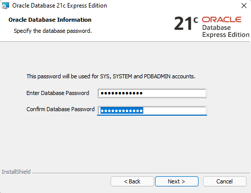
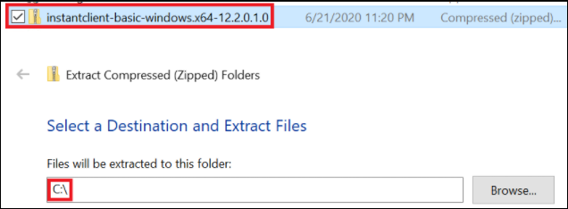
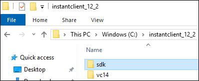
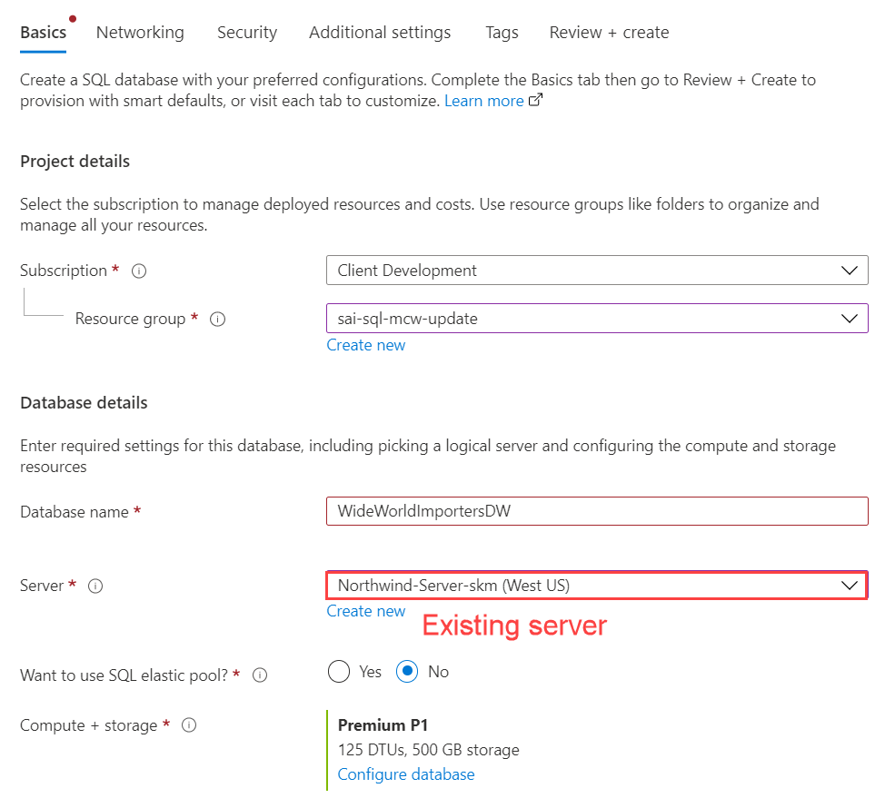
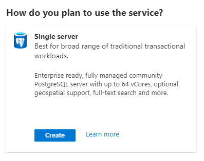
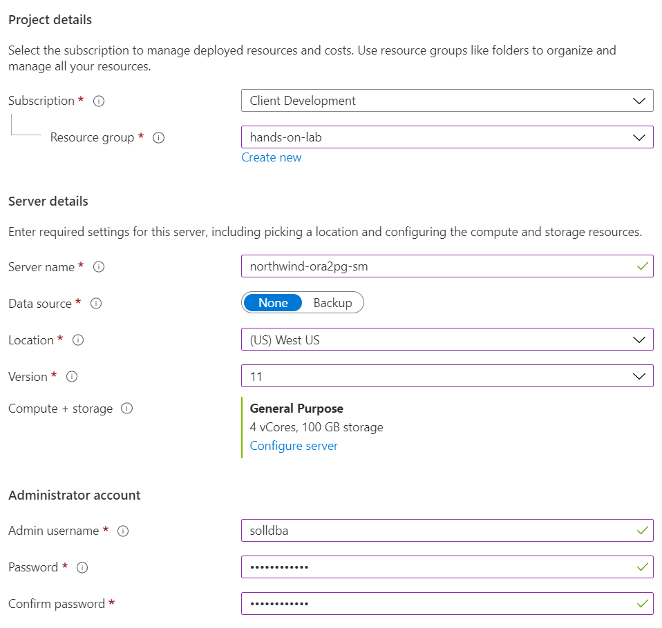
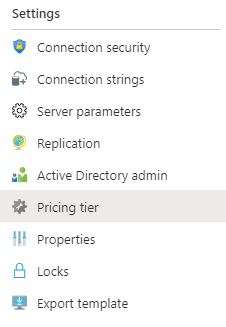
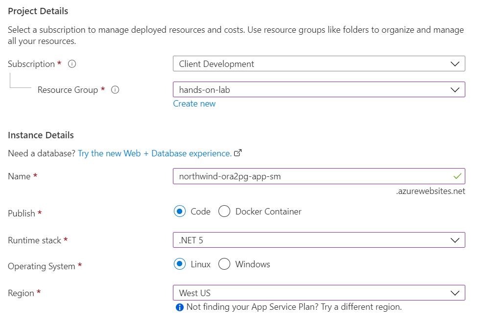
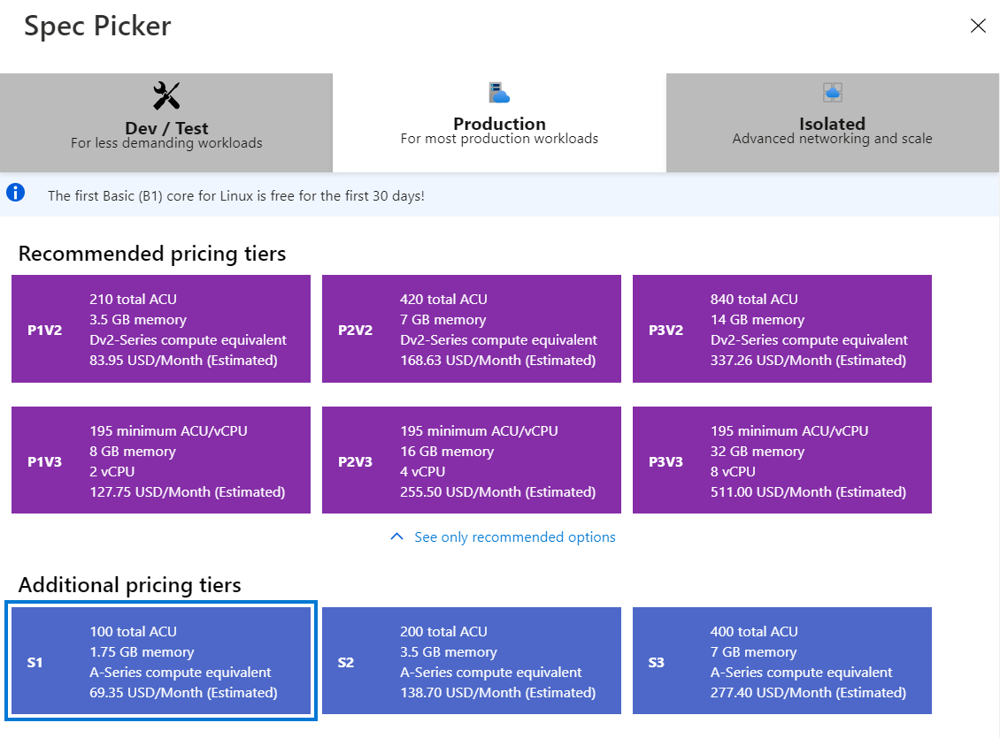

Migrating Oracle to Azure SQL and PostgreSQL

Before the hands-on lab Manual Resource setup guide

September 2021

Information in this document, including URL and other Internet Web site references, is subject to change without notice. Unless otherwise noted, the example companies, organizations, products, domain names, e-mail addresses, logos, people, places, and events depicted herein are fictitious, and no association with any real company, organization, product, domain name, e-mail address, logo, person, place or event is intended or should be inferred. Complying with all applicable copyright laws is the responsibility of the user. Without limiting the rights under copyright, no part of this document may be reproduced, stored in or introduced into a retrieval system, or transmitted in any form or by any means (electronic, mechanical, photocopying, recording, or otherwise), or for any purpose, without the express written permission of Microsoft Corporation.

Microsoft may have patents, patent applications, trademarks, copyrights, or other intellectual property rights covering subject matter in this document. Except as expressly provided in any written license agreement from Microsoft, the furnishing of this document does not give you any license to these patents, trademarks, copyrights, or other intellectual property.

The names of manufacturers, products, or URLs are provided for informational purposes only and Microsoft makes no representations and warranties, either expressed, implied, or statutory, regarding these manufacturers or the use of the products with any Microsoft technologies. The inclusion of a manufacturer or product does not imply endorsement of Microsoft of the manufacturer or product. Links may be provided to third party sites. Such sites are not under the control of Microsoft and Microsoft is not responsible for the contents of any linked site or any link contained in a linked site, or any changes or updates to such sites. Microsoft is not responsible for webcasting or any other form of transmission received from any linked site. Microsoft is providing these links to you only as a convenience, and the inclusion of any link does not imply endorsement of Microsoft of the site or the products contained therein.

© 2021 Microsoft Corporation. All rights reserved.

Microsoft and the trademarks listed at <https://www.microsoft.com/en-us/legal/intellectualproperty/Trademarks/Usage/General.aspx> are trademarks of the Microsoft group of companies. All other trademarks are property of their respective owners.

**Contents**

- [Migrating Oracle to Azure SQL and PostgreSQL before the hands-on lab setup guide (manual steps)](#migratingoracletoazuresql-andpostgresql-before-the-hands-on-lab-setup-guide-manual-steps)
  - [Requirements](#requirements)
  - [Before the hands-on lab](#before-the-hands-on-lab)
    - [Task 1: Provision a resource group](#task-1-provision-a-resource-group)
    - [Task 2: Create lab virtual machine](#task-2-create-lab-virtual-machine)
    - [Task 3: Connect to the Lab VM](#task-3-connect-to-the-lab-vm)
    - [Task 4: Install Oracle XE](#task-4-install-oracle-xe)
    - [Task 5: Install Oracle Data Access components](#task-5-install-oracle-data-access-components)
    - [Task 6: Install SQL Developer Tool](#task-6-install-sql-developer-tool)
    - [Task 7 (Migrate to Azure SQL): Install SQL Server Migration Assistant for Oracle](#task-7-migrate-to-azure-sql-install-sql-server-migration-assistant-for-oracle)
    - [Task 8 (Migrate to PostgreSQL): Install pgAdmin on the LabVM](#task-8-migrate-to-postgresql-install-pgadmin-on-the-labvm)
    - [Task 9 (Migrate to PostgreSQL): Install the ora2pg utility](#task-9-migrate-to-postgresql-install-the-ora2pg-utility)
    - [Task 10 (Migrate to Azure SQL Optional Homogenous Migration): Create SQL Server 2008 R2 virtual machine](#task-10-migrate-to-azure-sql-optional-homogenous-migration-create-sql-server-2008-r2-virtual-machine)
    - [Task 11 (Migrate to Azure SQL Optional Homogenous Migration): Connect to the SqlServer2008 VM](#task-11-migrate-to-azure-sql-optional-homogenous-migration-connect-to-the-sqlserver2008-vm)
    - [Task 12 (Migrate to Azure SQL Optional Homogenous Migration): Install Data Migration Assistant on the SQL Server 2008 VM](#task-12-migrate-to-azure-sql-optional-homogenous-migration-install-data-migration-assistant-on-the-sql-server-2008-vm)
    - [Task 13 (Migrate to Azure SQL): Provision Azure SQL Database](#task-13-migrate-to-azure-sql-provision-azure-sql-database)
    - [Task 14 (Migrate to Azure SQL Optional Homogenous Migration): Create an Azure SQL Database for the Data Warehouse](#task-14-migrate-to-azure-sql-optional-homogenous-migration-create-an-azure-sql-database-for-the-data-warehouse)
    - [Task 15 (Migrate to Azure SQL Optional Homogenous Migration): Register the Microsoft DataMigration resource provider](#task-15-migrate-to-azure-sql-optional-homogenous-migration-register-the-microsoft-datamigration-resource-provider)
    - [Task 16 (Migrate to Azure SQL Optional Homogenous Migration): Create Azure Database Migration Service for SQL Server](#task-16-migrate-to-azure-sql-optional-homogenous-migration-create-azure-database-migration-service-for-sql-server)
    - [Task 17 (Migrate to PostgreSQL): Provision Azure Database for PostgreSQL](#task-17-migrate-to-postgresql-provision-azure-database-for-postgresql)
    - [Task 18 (Migrate to PostgreSQL): Configure the Azure Database for PostgreSQL Instance](#task-18-migrate-to-postgresql-configure-the-azure-database-for-postgresql-instance)
    - [Task 19 (Migrate to PostgreSQL): Create an App Service Instance](#task-19-migrate-to-postgresql-create-an-app-service-instance)

# Migrating Oracle to Azure SQL and PostgreSQL before the hands-on lab setup guide (manual steps)

## Requirements

- Microsoft Azure subscription must be pay-as-you-go or MSDN.
  - Trial subscriptions will not work.
- A virtual machine configured with:
  - Visual Studio 2019 Community (latest release)

In this lab, there are three major migration paths:

  - Migrating Oracle to Azure SQL
  - Migrating SQL Server 2008 R2 Data Warehouse to Azure SQL (*homogenous* migration)
  - Migrating Oracle to Azure Database for PostgreSQL

Regardless of which path(s) you complete, follow Tasks 1-3. After that, the Task titles indicate which migration paths they are intended for.

## Before the hands-on lab

Duration: 45 minutes

In the Before the Hands-on Lab Manual Resource Setup document, you will set up your environment for use in the rest of the hands-on lab. Note that we recommend the standard Before the Hands-on Lab document, as the ARM template facilitates a simpler, automated deployment. You should follow all the steps provided to prepare your environment **before attending** the hands-on lab. Failure to do so will significantly impact your ability to complete the lab within the time allowed.

> **Important**: Most Azure resources require unique names. Throughout this lab, you will see the word “SUFFIX” as part of resource names. You should replace this with your Microsoft alias, initials, or another value to ensure the resource is uniquely named.

### Task 1: Provision a resource group

In this task, you will create an Azure resource group for the resources used throughout this lab.

1. In the [Azure portal](https://portal.azure.com), select **Resource groups** from the Azure services list.

    

2. On the Resource groups blade, select **+Add**.

    

3. Enter the following in the Create an empty resource group blade:

    - **Subscription**: Select the subscription you are using for this hands-on lab.
    - **Resource group**: Enter hands-on-lab-SUFFIX.
    - **Region**: Select the region you would like to use for resources in this hands-on lab. Remember this location so you can use it for the other resources you'll provision throughout this lab.

    

4. Select **Review + Create**.

5. On the Review + Create tab, select **Create** to provision the resource group.

### Task 2: Create lab virtual machine

In this task, you will provision a virtual machine (VM) in Azure. The VM image used will have Visual Studio Community 2019 installed.

1. In the [Azure portal](https://portal.azure.com/), select the **Show portal menu** icon and then select **+Create a resource** from the menu.

    

2. Enter "visual studio 2019" into the Search the Marketplace box and select Visual Studio Latest.

    

3. On the Visual Studio 2019 Latest blade, select the Select a software plan drop-down list and then select **Visual Studio 2019 Community (latest release) on Windows Server 2019 (x64)** from the list.

    

4. Select **Create** on the Visual Studio 2019 Latest blade.

5. On the Create a virtual machine Basics tab, set the following configuration:

    - Project Details:

        - **Subscription**: Select the subscription you are using for this hands-on lab.
        - **Resource Group**: Select the hands-on-lab-SUFFIX resource group from the list of existing resource groups.

    - Instance Details:

        - **Virtual machine name**: Enter LabVM.
        - **Region**: Select the region you are using for resources in this hands-on lab.
        - **Availability options**: Select no infrastructure redundancy required.
        - **Image**: Leave Visual Studio 2019 Community (latest release) on Windows Server 2019 (x64) selected.
        - **Size**: Accept the default size, Standard D4s v3. If this VM tier is not the default size, select it. Having a larger memory capacity will accelerate the Oracle database install.

    - Administrator Account:

        - **Username**: demouser
        - **Password**: Password.1!!

    - Inbound Port Rules:

        - **Public inbound ports**: Choose Allow selected ports.
        - **Select inbound ports**: Select RDP (3389) in the list.

        

6. Select **Review + create**.

7. On the **Review + create** tab, ensure the Validation passed message is displayed, and then select **Create** to provision the virtual machine.

    

8. It may take 10+ minutes for the virtual machine to complete provisioning. You can move on to the next task while waiting for the lab VM to provision.

### Task 3: Connect to the Lab VM

In this task, you will create an RDP connection to your Lab virtual machine (VM) and disable Internet Explorer Enhanced Security Configuration.

1. In the [Azure portal](https://portal.azure.com), select **Resource groups** from the Azure services list.

    

2. On the Resource groups blade, enter your resource group name (hands-on-lab-SUFFIX) into the filter box, and select it from the list.

    

3. In the list of resources for your resource group, select the LabVM Virtual Machine.

    

4. On your Lab VM blade, select **Connect** from the top menu.

    

5. Select **Download RDP file**, then open the downloaded RDP file.

    

6. Select **Connect** on the Remote Desktop Connection dialog.

    

7. Enter the following credentials when prompted:

    - **Username**: demouser
    - **Password**: Password.1!!

8. Select **Yes** to connect, if prompted that the identity of the remote computer cannot be verified.

    

9. Once logged in, launch the **Server Manager**. This should start automatically, but you can access it via the Start menu if it does not.

    

10. Select **Local Server**, then select **On** next to **IE Enhanced Security Configuration**.

    

11. In the Internet Explorer Enhanced Security Configuration dialog, select **Off** under both Administrators and Users, and then select **OK**.

    

12. Close the Server Manager.

### Task 4: Install Oracle XE

If you want to complete the Oracle to PostgreSQL or Oracle to Azure SQL Database labs, you need to complete this step to install the Express Edition (XE) of Oracle database.

The same applies for Tasks 5 and 6.

1. In a web browser on your Lab VM, navigate to <https://www.oracle.com/database/technologies/xe-downloads.html>.

2. On the Oracle Database XE Downloads page, select **Oracle Database 21c Express Edition for Windows x64** download link. Allow the file to download.

   

3. Accept the license agreement, if you are presented with one.

4. Extract the ZIP file. Right-click `setup.exe`, and select **Run as administrator**.

5. Select **Next** to step through each screen of the installer, accepting the license agreement and default values, until you get to the **Specify Database Passwords** screen.

6.  On the **Oracle Database Information** screen, set the password to **Password.1!!**, and select **Next**.

    

7.  Select **Install**. Once the installation completes, take note of the ports assigned.

    

8.  Select **Finish** on the final dialog to complete the installation.

### Task 5: Install Oracle Data Access components

1. On your Lab VM, navigate to <http://www.oracle.com/technetwork/database/windows/downloads/index-090165.html>.

2. On the 64-bit Oracle Data Access Components (ODAC) Downloads page, scroll down and locate the **64-bit ODAC 12.2c Release 1 (12.2.0.1.1) for Windows x64** section, and then select the **ODAC122011_x64.zip** link.

    Downloads screen")

3. Accept the license agreement, and then select **Download ODAC122011_x64.zip**.

   

4. When the download completes, extract the contents of the ZIP file to a local drive.

5. Navigate to the folder containing the extracted ZIP file, and right-click `setup.exe`, then select **Run as administrator** to begin the installation.

6. Select **Next** to accept the default language, English, on the first screen.

7. On the Specify Oracle Home User screen, accept the default, Use Windows Built-in Account, and select **Next**.

8. Accept the default installation locations, and select **Next**.

9. On the **Available Product Components**, uncheck **Oracle Data Access Components Documentation for Visual Studio**, and select **Next**.

   

10. On the ODP.NET screen, check the box for **Configure ODP.NET and/or Oracle Providers for ASP.NET at machine-wide level**, and select **Next**.

    

11. If the Next button is disabled on the Perform Prerequisite Checks screen, check the **Ignore All** box, and then select **Next**. This screen will be skipped by the installer if no missing prerequisites are found.

    

12. On the Summary screen, select **Install**.

13. On the Finish screen, select **Close**.

### Task 6: Install SQL Developer Tool

In this task, you will install Oracle SQL Developer, a common IDE to interact with Oracle databases.

1. On your Lab VM, open a web browser and navigate to <https://www.oracle.com/tools/downloads/sqldev-downloads.html>.

2. Scroll down on the page and download **Windows 64-bit with JDK 8 included**.

   

3. Accept the license terms. Extract the files to `C:\Tools`.

4. Navigate to `C:\Tools\sqldeveloper`. Select and run the executable file. Ensure that SQL Developer loads.

   

   >**Note**: If you are prompted to import preferences from a previous installation, select **No**.

### Task 7 (Migrate to Azure SQL): Install SQL Server Migration Assistant for Oracle

In the Oracle to Azure SQL migration lab, we will use the SQL Server Migration Assistant for Oracle to complete the schema and data migration.

1. Navigate to the [SSMA download site](https://www.microsoft.com/download/details.aspx?id=54258). Select **Download**.

    

2. You will then be prompted to select the SSMA installation package you need. Select `SSMAforOracle_8.x.msi`. Then, select **Next**.

    

3. Once the installer finishes downloading, launch it. The launch page for SSMA 8.x will open. Select **Next**.

    

4. Accept the license agreement. Select **Next**.

5. On the **Choose Setup Type** window, select **Typical**.

    

6. On the **Ready to Install** window, accept the defaults. Then, select **Install**.

    

7. Wait for the installation to complete.

### Task 8 (Migrate to PostgreSQL): Install pgAdmin on the LabVM

PgAdmin greatly simplifies database administration and configuration tasks by providing an intuitive GUI. Hence, we will be using it to create a new application user and test the migration.

1. On the LabVM, in Internet Explorer, navigate to <https://www.pgadmin.org/download/pgadmin-4-windows/> to obtain **pgAdmin 4**. At the time of writing, **v5.5** is the most recent version. Select the link to the installer, as shown below.

    

2. Download the **pgadmin4-5.5-x64.exe** file.

3. Once the installer launches, accept all defaults. Complete the installation steps.

4. To open pgAdmin, use the Windows Search utility. Type `pgAdmin`.

   

5. PgAdmin will prompt you to set a password to govern access to database credentials. Enter `oracledemo123`. Confirm your choice. For now, our configuration of pgAdmin is complete.

### Task 9 (Migrate to PostgreSQL): Install the ora2pg utility

**Ora2pg** is the tool we will use to migrate database objects and data. Microsoft's Data Migration Team has greatly simplified the process of obtaining this tool by providing the **installora2pg.ps1** script. You can access the script at the `C:\handsonlab\MCW-Migrating-Oracle-to-Azure-SQL-and-PostgreSQL\Hands-on lab\lab-files\installora2pg.ps1` location.

1. Navigate to the location mentioned above and right-click `installora2pg.ps1`. Then, select **Run with PowerShell**.

    

    >**Note:** If you are warned about a PS execution policy change, accept ALL of the policy changes.

    You should see the script executing.

    

2. Install the ora2pg utility dependencies.

   - Install Perl. It will take five minutes.
   - Install the Oracle client library and SDK. To do this, you will first need to navigate to [Oracle Downloads](https://www.oracle.com/database/technologies/instant-client/winx64-64-downloads.html). Then, scroll to **Version 12.2.X**. Select the installer for the **Basic Package**.
   - Download the zip file.

    

    > **Note**: If you encounter any script execution errors, try running the script again.

3. On the same Oracle link as above under the **version** section, locate the **SDK Package** installer under the **Development and Runtime - optional packages** section. Keep the zipped file in the Downloads directory.

    

4. Navigate to the directory where the zipped instant client packages reside.

    - For the basic package, right-click it, and select **Extract All...**.
    - When prompted to choose the destination directory, navigate to the `C:\` location.
    - Select **Extract**.
    - Repeat this process for the zipped SDK.

    

    Your folder path should show:

    

5. Install the Git client and ora2pg utility.  
    - Return to the PowerShell script.
    - Press any key to terminate the script's execution, if the PS window is still visible.
    - Open Explorer and rename the  `C:\instantclient_12_2` folder to `C:\instantclient`.
    - Launch the script one more time for install path validation purposes.
    - If the previous steps were successful, the script should be able to locate **oci.dll** under `C:\instantclient\oci.dll`.

        >**Note**: If the script still cannot find `oci.dll`, rename the Instant Client extract folder name to `C:\instantclient` exactly.

    

    If the path is correct, you should see the script downloading the Git installer.

    

    >**Note**: The script may throw errors of not being able to find a Git executable at a certain location. This should not impact the installation.

    A successful installation should have a PowerShell screen that resembles this:

    

6. Once ora2pg installs, you will need to configure PATH variables.

    - Search for **View advanced system settings** in Windows.
    - Select the result, and the **System Properties** dialog box should open.
    - By default, the **Advanced** tab should be showing, but if not, navigate to it.
    - Then, select **Environment Variables...**.

    

7. Under **System variables**, select **Path**. Select **Edit...**.

    

8. The **Edit environment variable** box should be displaying.

    - Select **New**.
    - Enter **C:\instantclient**.
    - Repeat this process, but enter **%%PATH%%** instead.

    

### Task 10 (Migrate to Azure SQL Optional Homogenous Migration): Create SQL Server 2008 R2 virtual machine

In this task, you will provision another virtual machine (VM) in Azure which will host your "on-premises" instance of SQL Server 2008 R2. The VM will use the SQL Server 2008 R2 SP3 Standard on Windows Server 2008 R2 image.

>**Note**:  An older version of Windows Server is being used because SQL Server 2008 R2 is not supported on Windows Server 2016.

1. In the [Azure portal](https://portal.azure.com/), select the **Show portal menu** icon and then select **+Create a resource** from the menu.

    

2. Enter "SQL Server 2008R2SP3 on Windows Server 2008R2" into the Search the Marketplace box and press Enter.

3. On the **SQL Server 2008 R2 SP3 on Windows Server 2008 R2** blade, select **SQL Server R2 SP3 Standard on Windows Server 2008 R2** for the software plan and then select **Create**.

    

4. On the Create a virtual machine Basics tab, set the following configuration:

   - Project Details:

     - **Subscription**: Select the subscription you are using for this hands-on lab.
     - **Resource Group**: Select the hands-on-lab-SUFFIX resource group from the list of existing resource groups.

   - Instance Details:

     - **Virtual machine name**: Enter SqlServer2008.
     - **Region**: Select the region you are using for resources in this hands-on lab.
     - **Availability options**: Select no infrastructure redundancy required.
     - **Image**: Leave SQL Server 2008 R2 SP3 Standard on Windows Server 2008 R2 selected.
     - **Size**: Select Standard D4s v3. You can accept the default larger tier, but to minimize costs, we recommend Standard D4s v3.

   - Administrator Account:

     - **Username**: demouser
     - **Password**: Password.1!!

   - Inbound Port Rules:

     - **Public inbound ports**: Choose Allow selected ports.
     - **Select inbound ports**: Select RDP (3389) in the list.

    

5. Select the **SQL Server settings** tab from the top menu. The default values will be used for Disks, Networking, Management, and Advanced, so you don't need to do anything on those tabs.

    

6. On the **SQL Server settings** tab, set the following properties:

   - Security & Networking:

     - **SQL connectivity**: Select Public (Internet).
     - **Port**: Leave set to 1433.

     > **Note**: SQL Connectivity is being set to public for this hands-on lab to simplify access during the lab. In a production environment, you would want to limit connectivity to only those IP addresses that require access.

   - SQL Authentication:

     - **SQL Authentication**: Select Enable.
     - **Login name**: demouser
     - **Password**: Password.1!!

     

7. Select **Review + create** to review the VM configuration.

8. On the **Review + create** tab, ensure the Validation passed message is displayed, and then select **Create** to provision the virtual machine.

    

9. It may take 10+ minutes for the virtual machine to complete provisioning. You can move on to the next task while waiting for the SqlServer2008 VM to provision.

### Task 11 (Migrate to Azure SQL Optional Homogenous Migration): Connect to the SqlServer2008 VM

In this task, you will create an RDP connection to the SqlServer2008 VM and disable Internet Explorer Enhanced Security Configuration.

1. In the [Azure portal](https://portal.azure.com), select **Resource groups** from the Azure services list.

    

2. On the Resource groups blade, enter your resource group name (hands-on-lab-SUFFIX) into the filter box, and select it from the list.

    

3. In the list of resources for your resource group, select the SqlServer2008 Virtual Machine.

    

4. On the SqlServer2008 blade in the [Azure portal](https://portal.azure.com), select **Overview** from the left-hand menu, and then select **Connect** from the top menu.

    

5. Select **Download RDP file**, then open the downloaded RDP file.

    

6. Select **Connect** on the Remote Desktop Connection dialog.

    

7. Enter the following credentials when prompted:

    - **Username**: demouser
    - **Password**: Password.1!!

8. Select **Yes** to connect, if prompted that the identity of the remote computer cannot be verified.

    

9. Once logged in, launch the **Server Manager**. This should open automatically, but you can access it via the taskbar or Start menu if it does not.

    

10. In Server Manager, select **Configure IE ESC** in the Security Information section of the Server Summary.

    

11. On the Internet Explorer Enhanced Security Configuration dialog, select **Off** under both Administrators and Users, and then select **OK**.

    

12. Close the Server Manager.

### Task 12 (Migrate to Azure SQL Optional Homogenous Migration): Install Data Migration Assistant on the SQL Server 2008 VM

In the optional homogenous migration, you will use the Data Migration Assistant to assess the SQL Server 2008 R2 instance for incompatibilities with Azure SQL Database and then migrate the database schema using the tool.

1. On the SqlServer2008 VM, install the .NET Framework 4.8 Runtime, a requirement for Data Migration Assistant to run. Locate the downloader [here.](https://dotnet.microsoft.com/download/dotnet-framework/net48) Restart the system.

2. Download the [Data Migration Assistant v5.x](https://www.microsoft.com/download/confirmation.aspx?id=53595) and run the downloaded installer.

3. Select **Next** on each of the screens, accepting the license terms and privacy policy in the process.

4. Select **Install** on the Privacy Policy screen to begin the installation.

5. On the final screen, optionally check the **Launch Microsoft Data Migration Assistant** check box, and select **Finish**.

   

### Task 13 (Migrate to Azure SQL): Provision Azure SQL Database

In this task, you will create an Azure SQL Database, which will serve as the target database for migration of the on-premises Oracle database into the cloud. This is for the OLTP database migration.

1. In the [Azure portal](https://portal.azure.com/), select the **Show portal menu** icon and then select **+Create a resource** from the menu.

    

2. Enter "sql database" into the Search the Marketplace box, select **SQL Database** from the results, and then select **Create**.

    

3. On the SQL Database Basics tab, enter the following:

    - Project Details:

      - **Subscription**: Select the subscription you are using for this hands-on lab.
      - **Resource Group**: Select the hands-on-lab-SUFFIX resource group from the list of existing resource groups.

    - Database Details:

      - **Database name**: Enter Northwind
      - **Server**: Select Create new, and then on the New server blade, enter the following:
        - **Server name**: Enter a unique name, such as northwind-server-SUFFIX.
        - **Server admin login**: demouser
        - **Password**: Password.1!!
        - **Location**: Select the location you are using for resources in this hands-on lab.
        - Select **OK**.
      - **Want to use SQL elastic pool?**: Select **No**.

      

      - **Compute + storage**: Select **Configure database**.

      

      - On the Compute + storage blade, expand the **Service tier** dropdown. Select **Premium** below **DTU-based purchasing model**. The default configuration will be `125 DTUs` and `500 GB` storage. Accept the default value for **Read scale-out**. Select **Apply**.

      

4. Select **Next: Networking**.

5. On the Networking tab, set the following configuration:

    - **Connectivity method**: Select **Public endpoint**.
    - **Allow Azure services and resources to access this server**: Select **Yes**.
    - **Add current client IP address**: Select **No**. If you would like to be able to access the database from your local machine (not required for this lab), you can set this to Yes.

    

6. Select **Review + Create**.

7. On the Review + Create tab, select **Create** to provision the Azure SQL Database.

    > **Note**: The [Azure SQL Database firewall](https://docs.microsoft.com/azure/sql-database/sql-database-firewall-configure) prevents external applications and tools from connecting to the server or any database on the server unless a firewall rule is created to open the firewall for the specific IP address. When creating the new server above, the **Allow azure services to access server** setting was allowed, which allows any services using an Azure IP address to access this server and databases, so there is no need to create a specific firewall rule for this hands-on lab. To access the SQL server from an on-premises computer or application, you need to [create a server-level firewall rule](https://docs.microsoft.com/azure/sql-database/sql-database-get-started-portal#create-a-server-level-firewall-rule) to allow the specific IP addresses to access the server.

### Task 14 (Migrate to Azure SQL Optional Homogenous Migration): Create an Azure SQL Database for the Data Warehouse

If you are completing the optional homogenous migration, complete this task to create the landing zone for the Data Warehouse migration.

1. Repeat the steps in the previous task, creating a new database called `WideWorldImportersDW`. **However, do not create a new server! Select the existing server that you created in the last Task.**

    

An Azure SQL Database *server* is just a management entity, akin to how multiple SQL Server databases reside on an individual SQL Server instance.

### Task 15 (Migrate to Azure SQL Optional Homogenous Migration): Register the Microsoft DataMigration resource provider

In this task, you will register the `Microsoft.DataMigration` resource provider with your subscription in Azure.

1. In the [Azure portal](https://portal.azure.com/), navigate to the Home page and then select **Subscriptions** from the Navigate list found midway down the page.

    

2. Select the subscription you are using for this hands-on lab from the list, select **Resource providers**, enter "migration" into the filter box, and then select **Register** next to **Microsoft.DataMigration**.

    

### Task 16 (Migrate to Azure SQL Optional Homogenous Migration): Create Azure Database Migration Service for SQL Server

In this task, you will provision an instance of the Azure Database Migration Service (DMS).

1. In the [Azure portal](https://portal.azure.com/), select the **Show portal menu** icon and then select **+Create a resource** from the menu.

    

2. Enter "database migration" into the Search the Marketplace box, select **Azure Database Migration Service** from the results, and select **Create**.

    

3. On the Create Migration Service blade, enter the following:

    - **Subscription**: Select the subscription you are using for this hands-on lab.
    - **Resource Group**: Select the hands-on-lab-SUFFIX resource group from the list of existing resource groups.
    - **Migration service name**: Enter **wwi-dms-SUFFIX**.
    - **Location**: Select the location you are using for resources in this hands-on lab.
    - **Pricing tier**: Select Standard: 1 vCores.

    > **Note**: If you see the message `Your subscription doesn't have proper access to Microsoft.DataMigration`, refresh the browser window before proceeding. If the message persists, verify you successfully registered the resource provider, and then you can safely ignore this message.

   

4. Select **Next: Networking**.

5. On the Network tab, select the **hands-on-lab-SUFFIX-vnet/default** virtual network. This will place the DMS instance into the same VNet as your SQL Server VM and Lab VM.

    

6. Select **Review + create**.
  
7. Select **Create**.

>**Note**: It can take 15 minutes to deploy the Azure Data Migration Service.

### Task 17 (Migrate to PostgreSQL): Provision Azure Database for PostgreSQL

If you are completing the PostgreSQL migration lab, in this Task, you will prepare the landing zone.

1. Navigate to the **New** page accessed by selecting **+ Create a resource**. Then, navigate to **Databases** under the **Azure Marketplace** section. Select **Azure Database for PostgreSQL**.

    

2. There are four deployment options. For our simple transactional application, we will be utilizing a single server for our database.

    

3. Create a new Azure Database for PostgreSQL resource. Use the following configuration values:

   - **Resource group**: Same as the other lab resources
   - **Server name**: Enter a unique server name, such as `northwind-ora2pg-SUFFIX`
   - **Data source**: Select `None`
   - **Location** Select the same region as your other lab resources
   - **Version**: 11
   - **Compute + storage**: `General Purpose (4 vCores, 100 GB storage)`
   - **Administrator username**: `solldba`
   - **Password**: Provide a secure password

    Select the **Review + create** button once you are ready.

    

4. Select **Create** to start the deployment. Once the deployment completes, we will move on to configuring the instance.

### Task 18 (Migrate to PostgreSQL): Configure the Azure Database for PostgreSQL Instance

In this task, we will be modifying the PostgreSQL instance to fit our needs.

1. Storage Auto-growth is a feature in which Azure will add more storage automatically when required. We do not need it for our purposes so we will need to disable it. To do this, locate the PostgreSQL instance you created. Under the **Settings** tab, select **Pricing tier**.

    

2. Find the **Storage Auto-growth** switch, and disable the feature. Select **OK** at the bottom of the page to save your change.

    

3. Now, we need to implement firewall rules for the PostgreSQL database so we can access it. Locate the **Connection security** selector under the **Settings** tab.

    

4. We will add a network access rule. Since we are storing insecure test data, select **Allow access to Azure services**. This means that all public IP addresses associated with Azure have network access to the PostgreSQL instance, even if they are located in other subscriptions or tenants.

    

    >**Note**: Do not use this type of rule for databases with sensitive data or in a production environment. You are allowing access from any Azure IP address.

### Task 19 (Migrate to PostgreSQL): Create an App Service Instance

As part of the PostgreSQL lab, you will host the modified application in Azure App Service. You will provision a Web App and an App Service Plan in this Task.

1. On the **New** page, navigate to **Web** under **Azure Marketplace**. Select **Web App**.

    

2. Configure the following details for the App Service instance.

    - **Subscription**: Use the lab Azure subscription
    - **Resource Group**: Select the hands-on-lab-SUFFIX resource group
    - **Name**: Use `northwind-ora2pg-app-SUFFIX`
    - **Publish**: Select `Code`
    - **Runtime stack**: Select `.NET 5`
    - **Operating system**: Select `Linux`
    - **Region**: If available, choose the region that you are using for the lab resources

    

3. Scroll to the **App Service Plan** section.

    - **Linux Plan (REGION)**: Select **Create new**
      - Enter a unique name for the App Service Plan, like `northwind-ora2pg-plan-SUFFIX`
    - **Sku and size**: Select **Change size**. Select **Standard S1**.
      - Note that you may need to expand the **Production** pricing tiers to locate Standard S1

        

    

4. Select **Review + create**. Once validation passes, select **Create**.

You should follow all steps provided *before* performing the Hands-on lab.
